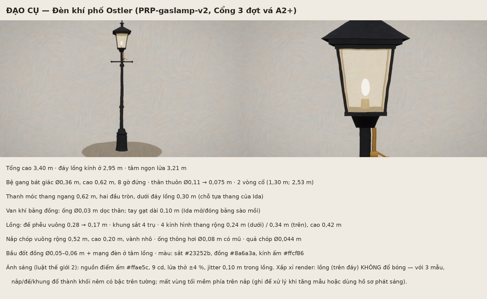

# ĐẠO CỤ — Đèn khí phố Ostler (PRP-gaslamp-v2)

Cổng 3 đợt vá A2+ (V4: bản cũ là khối hộp trơn). Mã dựng: `design/cong3/shared/props.js` (`buildGasLamp`). Ảnh: `bible/props/img/gas-lamp.png` (toàn thân và cận lồng, render bằng pipeline hướng C, shot `prop_gaslamp`).

| Bộ phận | Kích thước (m) | Ghi chú |
|---|---|---|
| Tổng cao | 3,40 | đáy lồng kính ở 2,95; tâm ngọn lửa 3,21 |
| Bệ | Ø0,36–0,40, cao 0,62 | gang bát giác, 8 gờ đứng, vành trên/dưới |
| Thân | Ø0,11 → 0,075 | thuôn, 2 vòng cổ ở 1,30 và 2,53 |
| Thanh móc thang | dài 0,62, Ø0,035, hai đầu cầu Ø0,06 | dưới đáy lồng 0,30 — chỗ Ida tựa thang |
| Van khí | ống đồng Ø0,03 dài 0,30; thân van Ø0,056; tay gạt 0,10 | Ida mở/đóng bằng sào mồi |
| Đế phễu lồng | vuông, đường chéo 0,28 → 0,17, cao 0,10 | |
| Khung lồng | 4 trụ góc 0,018 × 0,018; vành trên, vành dưới | sắt |
| Kính | 4 tấm hình thang, rộng 0,24 (dưới) / 0,34 (trên), cao 0,42 | kính ấm #ffcf86, bán trong |
| Nắp | chóp vuông rộng 0,52, cao 0,20; vành nhô 0,44 × 0,44 | |
| Thông hơi | ống Ø0,08 cao 0,08 + mũ côn Ø0,15; quả chóp Ø0,044 | |
| Bầu đốt | đồng Ø0,05–0,06, cao 0,06; mạng đèn ở tâm lồng | |

Màu: sắt #23252b / #30333b, đồng #8a6a3a, kính #ffcf86, lửa #fff0c8.

Ánh sáng (luật thế giới mục 2): nguồn điểm ấm #ffae5c, 9 cd, lửa thở ±4 %, vị trí jitter trong lồng 0,10 m (bóng mềm).

**Xấp xỉ render (ghi để xử lý sau):** các phần của lồng cao hơn đáy lồng (nắp, đế phễu, khung, vành) **không đổ bóng**. Với 3 mẫu jitter/khung, chúng đổ thành các khối nêm có bậc trên tường (đo ở clip đi bộ A2+). Hệ quả: mất vùng tối mềm phía trên nắp (ngoài đời có). Xử lý khi tăng mẫu hoặc thay bằng hồ sơ phát sáng của nguồn.
