# Thư viện mẫu Last Lamplighters (`scripts/ll/lib/`)

Mỗi mẫu có: ảnh xem trước (khung test `tests/tpl.yaml`, `preview/<mẫu>.jpg`), tham số chính, tiêu chí nhận và các tập đã dùng.
- Test tự động: `bash scripts/ll/tests/run.sh`. So khung với `tests/ref/`; `--update` ghi lại tham chiếu sau khi sửa mẫu có chủ ý.
- **Luật:** chỉ viết thành script khi một việc đã làm tay từ **3 lần** (chủ dự án, 05/10/2026).

## Mẫu đồ hoạ (`charts.js`)
| Mẫu | Xem trước | Tham số chính | Tiêu chí nhận | Tập đã dùng |
|---|---|---|---|---|
| `text` | 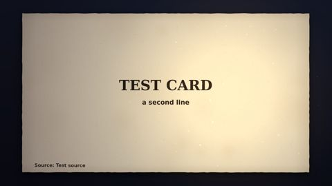 | `lines[{s, px, at, serif, color}]`, `beats`, `align`, `lh`, `lamp`, `src` | mỗi dòng neo vào một từ; không đứng > 3 s (Q11) | 1–5 |
| `bars` | 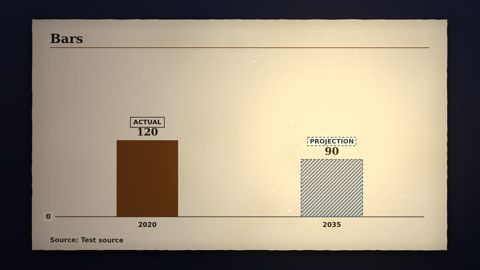 | `bars[{label, num, at, echo}]`, `unit`, `max`, `d`, `kindEach`, `note/noteAt`, `beats` | trục từ 0; nhãn ACTUAL/PROJECTION từng cột (`kindEach`); số dự báo gạch chéo | 1–5 |
| `line` | 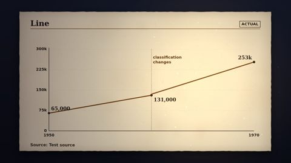 | `series[{points, labels, ltext, lpos, proj_from, name}]`, `xr`, `xticks`, `ymax`, `yfmt: k`, `marks[{x, label, at}]`, `at`, `dur` | đổi phân loại thì **hai series riêng + `marks`** (không nối); `lpos: below` khi hai nhãn trùng x | 1–4 |
| `bignum` | 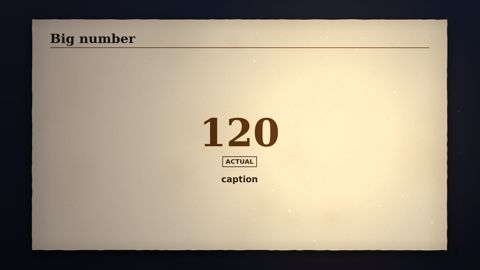 | `num` hoặc `value/text`, `prefix/suffix`, `d`, `caption/capAt`, `icon`, `beats`, `kind` | loại số lấy từ `nums`; khoảng số (`range`, `"50–80…"`) hiện thẳng, không đếm | 1–5 |
| `bignum` (khoảng) | 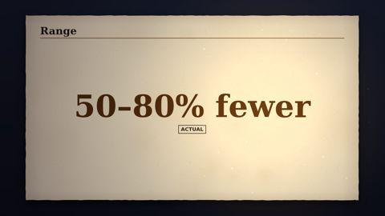 | `value: [a, b]` hoặc `text: "50–80% fewer"` | như trên | 2 |
| `compare` | 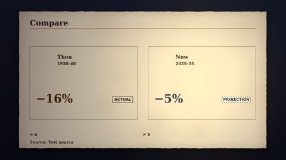 | `left/right{title, years, num, at, icon}`, `mid/midAt`, `diff/diffAt` | hai vế cùng đơn vị (ll.py chặn); **chỉ dùng khi cùng cơ chế và cùng kỳ** (BAI-HOC #17) | 2 |
| `quote` |  | `text`, `who`, `where`, `at`, `beats` | nguyên văn; Shorts ≤ ~12 từ mỗi thẻ (BAI-HOC #6) | 1–5 |
| `map` | — | `city`, `year`, `groups` | phố không vượt nước; chỉ cầu có năm ≤ năm bản đồ | 1 |

## Mẫu cảnh (`scenes.js`)
| Mẫu | Xem trước | Tham số chính | Tiêu chí nhận | Tập đã dùng |
|---|---|---|---|---|
| `street` | 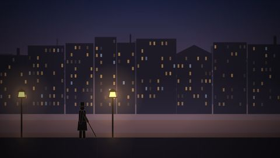 | `lamps[{x, lit}]`, `lighter{from, to, walk, lights}`, `warm`, `windows`, `cam` | ≥ 3 lớp parallax; người thắp đèn vô danh, không cận mặt | 1–5 |
| `office` |  | `light`, `cam` | đèn bật dần theo lời | 2–5 |
| `rows` switchboard | 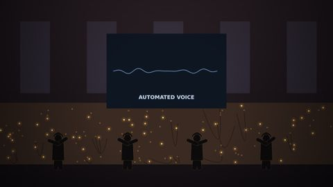 | `rows`, `per`, `dim`, `screen`, `screenLabel`, `cam` | đèn giắc tắt dần; màn hình "AUTOMATED VOICE" | 2 |
| `rows` typing | 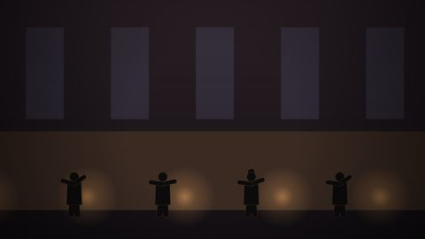 | như trên | đèn bàn tắt dần từ trái | 4–5 |
| `rows` teller (`TPL.teller`) | 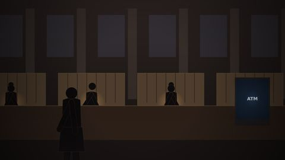 | `per`, `dim`, `screen` (ATM), `look` (ô giữa ngẩng lên), `customer{at, nervous}` | nhãn ATM ≥ 4,5:1 (nền `#0c1a2b`, chữ đậm, quầng ≤ 0,2) | 3 |
| `endcard` |  | `line`, `next` | thẻ kết hẹn tập sau | 1–5 |

## Thư viện HÌNH v2 (`props.js`, `v2.js`; chủ dự án 05/10/2026 — dùng từ tập 6)
Mọi mẫu v2 là **cảnh toàn khung** (không tính vào tỷ lệ thẻ giấy Q16) và nhận chú thích đè `cap` (số lớn + nhãn ACTUAL/PROJECTION + dòng nguồn).

| Mẫu | Xem trước | Tham số chính | Tiêu chí nhận | Tập đã dùng |
|---|---|---|---|---|
| `isotype` | 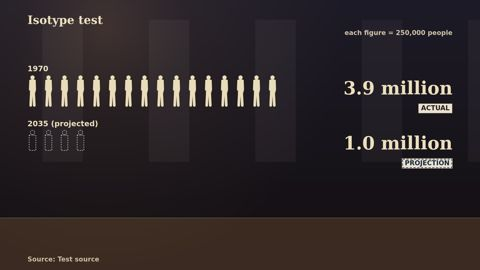 | `unit` (mỗi hình = N người), `unitName`, `groups[{label, num/value/text, at, kind}]`, `title/subtitle`, `src`, `cam` | hình hiện lần lượt; dự báo = hình viền đứt + PROJECTION; ghi "each figure = …" | lát cắt v2 |
| `stack` | 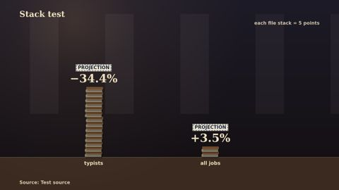 | `obj` (files, typewriter, atm, terminal, laptop, ledger, car, switchboard), `per`, `bars[{label, num/value, at, kind}]`, `s` | **dùng cho số đếm** (không dùng cho % giảm); ghi "each … = …"; số lẻ không làm tròn | lát cắt v2 |
| `stack` (ATM) | 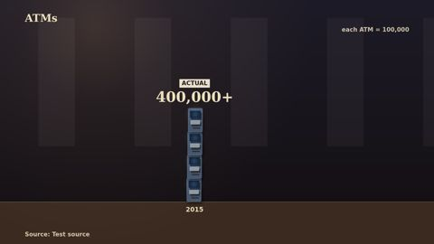 | như trên, `obj: atm` | — | — |
| `sign` | 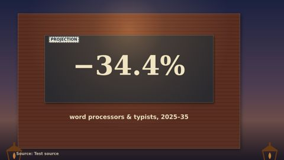 | `num/value/text`, `caption/capAt`, `at` (sơn dần), `kind`, `wall: brick/plaster` | một số neo mỗi biển | — |
| `desk` | 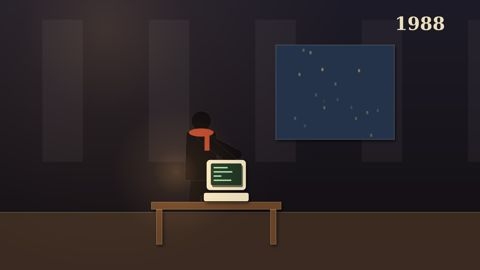 | `eras[{era: 1900/1920/1950/1965/1975/1988/2025, at, label}]`, `accent` (khăn quàng nhận diện) | nhân vật vô danh xuyên suốt; đạo cụ đúng thời kỳ | — |
| `archive` |  | `img`, `rid` (mã dòng RIGHTS), `credit`, `cam` (Ken Burns), `tone` | chỉ nguồn danh sách trắng; ≤ 20 % tập; luôn chuyển động máy + phủ tông B3; qc Q19 chặn khi thiếu hồ sơ | lát cắt v2 (LOC-8d03493) |

- Đạo cụ cắt giấy (`PROP.*`): typewriter, terminal, laptop, ledger, files, atm, counter, switchboard, car (`dent`), phone. Nhân vật: `worker(g, x, y, h, {era, accent})`.
- Ảnh tư liệu: `render.js` nạp sẵn vào `window.IMGS` (data URI) và chờ giải mã. Ảnh hiện có: `assets/ll/archive/` (mỗi tệp một dòng RIGHTS).

## Đã trượt — không dùng lại
| Cách làm | Trượt ở | Thay bằng |
|---|---|---|
| Khung đồ hoạ chỉ có tựa/trục khi lời đang nói | tập 1 L1; tập 2: 43 quãng > 3 s | `beats` neo vào từ; `ll.py est` báo trước |
| Một đường nối qua hai cách phân loại nghề | tập 1 L2; tập 3: biểu đồ HSUS D355 (sửa sau G2) | hai `series` + `marks` "classification changes" |
| Hai đợt dự báo trên một khung | tập 1 L4 | hai khung, ghi đợt |
| `bignum` đếm qua số trung gian của khoảng | tập 2 (50–80 %) | `range` |
| Nhãn ACTUAL cứng trong `bignum` | tập 2 Short S2 | `kind` từ `nums` |
| Nhãn "0", PROJECTION ở góc tối | tập 2 (< 4,5:1) | nền giấy + chữ đậm; giảm góc tối ánh rọi |
| Chữ sáng trên màn hình phát sáng + quầng 0,35 | tập 3 "ATM" 4,15:1 | nền tối, quầng 0,2 |
| Câu trích dài trong 9:16 | tập 3 S3 (tương phản 1:1, tràn) | tách thẻ trích ngắn |
| Thẻ `compare` xưa ↔ nay khác kỳ/khác cơ chế | tập 3 (+87 % 1960–70 ↔ −13 %), tập 4 (+69 % ↔ −2 %), tập 5 (bỏ ở G1) | thẻ `bars` cùng nguồn, cùng kỳ; lịch sử làm bối cảnh |
| Mốc `@từ` trùng lần xuất hiện đầu | tập 2 "@many", tập 3 "@fewer", tập 4 "@tasks" | `#2` hoặc từ khác; `ll.py est` |
| Thumbnail không lề | tập 2 T1 cắt chữ | `thumb.py` lề 5 %, qc Q12 |
| Phim chủ yếu thẻ giấy kem, đổi hình thưa | tập 3 (giấy 75 %, quãng tĩnh 21 s) | `cap` trên cảnh, mẫu v2, qc Q14–Q18 |
| Làm tròn số lẻ trên hình (3,5 % → "4 %") | thử v2 lần đầu | `fmtBig` giữ 1 chữ số lẻ khi số không nguyên |
